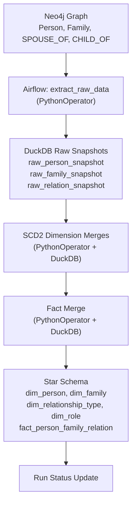

# Family Tree Warehouse

Airflow-based incremental ETL pipeline: Neo4j -> DuckDB star schema for family graph analytics.

## What this does

Extracts family tree data from Neo4j and builds a dimensional warehouse in DuckDB with:
- **SCD2 dimensions** for `person` and `family` tracking historical changes
- **Static dimensions** for relationship types and roles  
- **Fact table** capturing person-family relationships
- **Incremental snapshot-diff** strategy (no CDC required)

## Architecture

**Pipeline:** Neo4j (graph source) -> Python extraction -> DuckDB raw snapshots -> SQL transforms -> Star schema



## Star schema

**Dimensions:**
- `dim_person` (SCD2): tracks person attributes with versioning (`is_current`, `valid_from_run_id`, `valid_to_run_id`, `is_deleted`)
- `dim_family` (SCD2): tracks family attributes with versioning
- `dim_relationship_type`: static lookup (`SPOUSE_OF`, `CHILD_OF`)
- `dim_role`: static lookup (`HUSBAND`, `WIFE`, `NONE`)

**Fact:**
- `fact_person_family_relation`: grain = one row per `(person_id, family_id, relationship_type, role)` key  
- Tracks first/last seen run, soft deletes, FK links to current dimension rows

## Incremental strategy

**Snapshot-diff approach** (no CDC fields required in Neo4j):

1. Extract full source state into raw snapshot tables tagged with `run_id`
2. Compare snapshots using attribute hashes to detect SCD2 changes
3. Upsert dimension rows and expire outdated versions
4. Merge fact table and soft-delete missing relationships

This ensures reliable incremental loads without requiring `updated_at` columns in the source.

## Repository structure

```
family-tree-warehouse/
├── dags/
│   ├── family_tree_dw_dag.py
│   └── py/
│   │   └── extraction_utils.py
│   └── sql/
│       ├── init_schema.sql
│       ├── merge_dim_person_scd2.sql
│       ├── merge_dim_family_scd2.sql
│       ├── merge_fact_relation.sql
│       └── seed_reference_dimensions.sql
├── seed/
│   └── init_cruz_young_family_tree.cyp  # Sample Neo4j seed data
├── .docker/
│   └── airflow/
│       ├── Dockerfile
│       ├── entrypoint.sh
│       └── requirements.txt
├── .env.example                   # Environment template
├── docker-compose.yml             # Local Neo4j + Airflow stack
└── README.md
```

## Airflow DAG structure

**DAG:** `family_tree_dw_incremental` (daily schedule)

**Task graph:**
```
init_schema (Python)
    ↓
extract_raw_data (Python)
    ↓
seed_reference_dimensions (Python)
    ↓
merge_dim_person (Python) ──┐
merge_dim_family (Python) ──┤
    ↓                    │
merge_fact_relation (Python)
```

**Operators used:**
- `PythonOperator`: Neo4j extraction + raw load + SQL file execution against DuckDB

## Quick start

**Step 0: Create local environment file**
```bash
cp .env.example .env
```

**Optional (Linux): run Docker without `sudo`**
```bash
sudo usermod -aG docker $USER
newgrp docker
```

**Step 1: Start the stack**
```bash
sudo docker compose up -d --build
```

**Step 2: Wait for services** (~30-60 seconds for Airflow to initialize)

**Step 3: Seed demo Neo4j data**
```bash
# Reset graph (optional, for clean demo runs)
sudo docker exec family_tree_neo4j cypher-shell -u neo4j -p password "MATCH (n) DETACH DELETE n"

# Load sample family tree
sudo docker exec -i family_tree_neo4j cypher-shell -u neo4j -p password < seed/init_cruz_young_family_tree.cyp
```

**Step 4: Trigger the DAG**
```bash
# Unpause and trigger the ETL pipeline
sudo docker exec family_tree_airflow airflow dags unpause family_tree_dw_incremental
sudo docker exec family_tree_airflow airflow dags trigger family_tree_dw_incremental
```

**Step 5: Monitor**
- **Airflow UI:** http://localhost:8080 
- **Neo4j Browser:** http://localhost:7474

## Validation

**Check DAG runs:**
```bash
sudo docker exec family_tree_airflow airflow dags list-runs -d family_tree_dw_incremental
```

**Query warehouse:**
```bash
sudo docker exec family_tree_airflow python -c "
import duckdb
c = duckdb.connect('/opt/warehouse/family_tree.duckdb')
tables = ['raw_person_snapshot', 'raw_family_snapshot', 'raw_relation_snapshot', 
          'dim_person', 'dim_family', 'fact_person_family_relation']
for t in tables:
    print(f'{t}: {c.execute(f\"SELECT COUNT(*) FROM {t}\").fetchone()[0]} rows')
"
```

**View logs:**
```bash
# Airflow task logs
sudo docker logs family_tree_airflow

# All services
sudo docker compose logs -f
```
