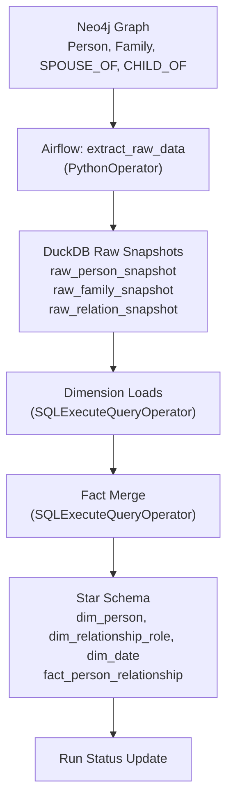

# Family Tree Warehouse

Airflow-based incremental ETL pipeline: Neo4j -> DuckDB star schema for family graph analytics.

## What this does

Extracts family tree data from Neo4j and builds a dimensional warehouse in DuckDB with:
- **SCD2 dimension** for `person` tracking historical changes
- **Semantic relationship-role dimension** (type + directed role + inverse/symmetry rules)
- **Calendar date dimension** for reusable time analysis
- **Factless fact table** capturing directed person-person relationships over time
- **Incremental snapshot-diff** strategy (no CDC required)

## Architecture

**Pipeline:** Neo4j (graph source) -> Python extraction -> DuckDB raw snapshots -> SQL transforms -> Star schema



## Star schema

**Dimensions:**
- `dim_person` (SCD2): tracks person attributes with versioning (`is_current`, `valid_from_run_id`, `valid_to_run_id`, `is_deleted`)
- `dim_relationship_role`: unified semantic dimension for relationship type + directed role (`relationship_role_code`, inverse role mapping, symmetry)
- `dim_date`: standard calendar dimension (`date_sk`, `full_date`, day/month/quarter/year attributes)

**Fact:**
- `fact_person_relationship`: grain = one row per directed relationship `(source_person_id, target_person_id, relationship_role_code, start_date, end_date, end_reason)`
- Tracks relationship lifecycle (`start_date`, nullable `end_date`, nullable `end_reason`) plus first/last seen run and soft deletes

**Derived relationships:**
- Spouse edges are generated in both directions from family spouse memberships
- Parent/child edges are generated in both directions
- Sibling logic uses shared parents: `SIBLING` for 2+ shared parents, `HALF_SIBLING` for exactly 1 shared parent

## Incremental strategy

**Snapshot-diff approach** (no CDC fields required in Neo4j):

1. Extract full source state into raw snapshot tables tagged with `run_id`
2. Compare snapshots using attribute hashes to detect SCD2 changes
3. Upsert dimension rows and expire outdated versions
4. Merge fact table and soft-delete missing relationships

This ensures reliable incremental loads without requiring `updated_at` columns in the source.

## Repository structure

```
family-tree-warehouse/
├── dags/
│   ├── family_tree_dw_dag.py
│   └── py/
│   │   └── extraction_utils.py
│   └── sql/
│       ├── init_schema.sql
│       ├── merge_dim_person_scd2.sql
│       ├── merge_dim_date.sql
│       ├── merge_fact_relation.sql
│       └── seed_reference_dimensions.sql
├── seed/
│   └── init_cruz_young_family_tree.cyp  # Sample Neo4j seed data
├── .docker/
│   └── airflow/
│       ├── Dockerfile
│       ├── entrypoint.sh
│       └── requirements.txt
├── .env.example                   # Environment template
├── docker-compose.yml             # Local Neo4j + Airflow stack
└── README.md
```

## Airflow DAG structure

**DAG:** `family_tree_dw_incremental` (daily schedule)

**Task graph:**
```
init_schema (SQL)
    ↓
extract_raw_data (Python)
    ↓
seed_reference_dimensions (SQL)
    ↓
merge_dim_person (SQL) ──┐
merge_dim_date (SQL) ────┤
    ↓                    │
merge_fact_relation (SQL)
```

**Operators used:**
- `PythonOperator`: Neo4j extraction + raw load
- `SQLExecuteQueryOperator`: executes SQL files through Airflow DuckDB connection (`duckdb_default`)

## Quick start

**Step 0: Create local environment file**
```bash
cp .env.example .env
```

**Optional (Linux): run Docker without `sudo`**
```bash
sudo usermod -aG docker $USER
newgrp docker
```

**Step 1: Start the stack**
```bash
sudo docker compose up -d --build
```

**Step 2: Wait for services** (~30-60 seconds for Airflow to initialize)

**Step 3: Seed demo Neo4j data**
```bash
# Reset graph (optional, for clean demo runs)
sudo docker exec family_tree_neo4j cypher-shell -u neo4j -p password "MATCH (n) DETACH DELETE n"

# Load sample family tree
sudo docker exec -i family_tree_neo4j cypher-shell -u neo4j -p password < seed/init_cruz_young_family_tree.cyp
```

**Step 4: Trigger the DAG**
```bash
# Unpause and trigger the ETL pipeline
sudo docker exec family_tree_airflow airflow dags unpause family_tree_dw_incremental
sudo docker exec family_tree_airflow airflow dags trigger family_tree_dw_incremental
```

**Step 5: Monitor**
- **Airflow UI:** http://localhost:8080 
- **Neo4j Browser:** http://localhost:7474

## Validation

**Check DAG runs:**
```bash
sudo docker exec family_tree_airflow airflow dags list-runs -d family_tree_dw_incremental
```

**Query warehouse:**
```bash
sudo docker exec -u 0 family_tree_airflow python -c "
import duckdb
c = duckdb.connect('/opt/warehouse/warehouse.duckdb')
tables = ['raw_person_snapshot', 'raw_family_snapshot', 'raw_relation_snapshot', 
      'dim_person', 'dim_relationship_role', 'dim_date', 'fact_person_relationship']
for t in tables:
    print(f'{t}: {c.execute(f\"SELECT COUNT(*) FROM {t}\").fetchone()[0]} rows')
"
```

If you get `Permission denied` on DuckDB, keep `-u 0` in the `docker exec` command for ad-hoc reads.

**View logs:**
```bash
# Airflow task logs
sudo docker logs family_tree_airflow

# All services
sudo docker compose logs -f
```
