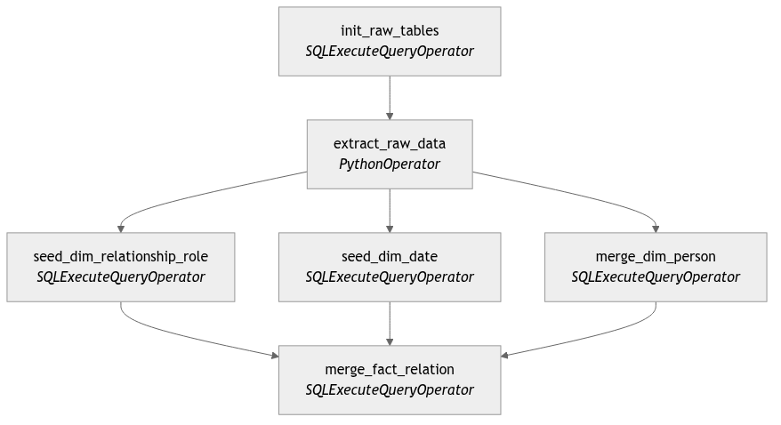

# Introduction

Genealogical data is inherently graph-structured, making Neo4j a natural source of truth. However, analytical workloads — aggregate counts, temporal metrics, historical change tracking — are better served by dimensional models and relational engines.

This project bridges that gap: a Neo4j graph feeds a DuckDB star schema through a daily incremental Airflow pipeline. Changes are detected via attribute hashing (no CDC required), person history is tracked via SCD2, and implicit relationships (siblings, parent–child) are derived from family membership.

# System Architecture

## High-Level Overview

Neo4j acts as the operational source of truth, storing persons and families as graph nodes with typed relationship edges. Apache Airflow runs a daily DAG that extracts a full snapshot from Neo4j via the Python driver, loads it into DuckDB staging tables tagged with a `run_id`, and then executes a series of SQL merge scripts to update the dimensional model. DuckDB serves as the analytical warehouse — all staging, dimension, and fact tables live in a single `.duckdb` file. Docker Compose brings up Neo4j and Airflow as isolated containers sharing a mounted data volume where the warehouse file resides.

## Technology Stack

| Layer                  | Technology                                   |
| ---------------------- | -------------------------------------------- |
| Source database        | Neo4j                                        |
| Warehouse database     | DuckDB                                       |
| Orchestration          | Apache Airflow                               |
| Airflow–DuckDB adapter | airflow-provider-duckdb                      |
| Neo4j Python driver    | neo4j                                        |
| Containerization       | Docker / Docker Compose                      |
| Scripting              | Python 3, SQL (DuckDB dialect), Cypher, Bash |
: Technology Stack

# Data Model

## Source Schema (Neo4j)

```
Node: Person     -- id, first_name, last_name, sex, birth_date,
                    death_date, education, works
Node: Family     -- id, marriage_date, divorce_date,
                    status (ACTIVE | WIDOWED | DIVORCED)

(Person)-[:SPOUSE_OF { role: HUSBAND | WIFE | PARTNER }]->(Family)
(Person)-[:CHILD_OF]->(Family)
```

## Staging Layer (DuckDB)

Raw snapshot tables capture the full source state per ETL run, keyed by `run_id`:
`etl_run_log`, `raw_person_snapshot`, `raw_family_snapshot`, `raw_relation_snapshot`.

## Dimensional Model (Star Schema)

**`dim_person` (SCD2)** — tracks full attribute history via `attr_hash` (MD5), `valid_from_run_id`, `valid_to_run_id`, `is_current`, and `is_deleted`.

**`dim_relationship_role`** — seven role codes covering all derived edge types:

| Role Code        | Type         | Symmetric |
| ---------------- | ------------ | --------- |
| `SPOUSE_HUSBAND` | SPOUSE       | false     |
| `SPOUSE_WIFE`    | SPOUSE       | false     |
| `SPOUSE_PARTNER` | SPOUSE       | true      |
| `PARENT`         | PARENT_CHILD | false     |
| `CHILD`          | PARENT_CHILD | false     |
| `SIBLING`        | SIBLING      | true      |
| `HALF_SIBLING`   | SIBLING      | true      |
: Relationship Role Codes

**`dim_date`** — conformed calendar from 1900-01-01 to 2099-12-31; `date_sk` formatted as `YYYYMMDD`.

**`fact_person_relationship`** — grain: one directed relationship per `(source_person, target_person, role, start_date)`. Carries FKs to all dimensions, `end_reason`, run-ID range tracking, and soft-delete flags.

Edges are derived from Family membership: spouse pairs, parent–child pairs, full siblings (same two parents), and half-siblings (one shared parent).

# ETL Pipeline

## Airflow DAG

**DAG ID:** `family_tree_dw_incremental` | **Schedule:** Daily | **Executor:** Sequential



## Incremental Strategy (Snapshot-Diff)

1. **Extract** — pull all nodes and edges from Neo4j; write into raw snapshot tables with current `run_id`.
2. **Detect changes** — compute `MD5` over tracked `dim_person` attributes; compare against stored `attr_hash`.
3. **SCD2 update** — expire changed rows (`valid_to_run_id`, `is_current = false`); insert new versions.
4. **Soft-delete** — flag persons and relationships absent from the current snapshot.
5. **Merge fact table** — re-derive all edges; upsert new or changed rows; soft-delete removed edges.

Re-running the same snapshot produces no changes (idempotent by design).

# Demo Dataset

The Cruz-Young family tree: 36 persons across 6 generations in 12 family units. Three incremental scenarios validate change-handling:

| #   | Change Type                  | What It Tests                                           |
| --- | ---------------------------- | ------------------------------------------------------- |
| 01  | New births + new marriage    | New SCD2 rows; new fact edges                           |
| 02  | Life event attribute updates | MD5 change detection; SCD2 expiry and version insert    |
| 03  | Relationship correction      | Soft-delete of incorrect edge; insert of corrected edge |
: Incremental Change Scenarios Applied to the Cruz-Young Demo Dataset

# Analytical Reports

| #   | Title                    | Description                                                     |
| --- | ------------------------ | --------------------------------------------------------------- |
| 01  | Person Relationship Card | All current relationships per person with roles and dates       |
| 02  | Marriage Timeline        | Marriage start/end dates, durations, and end reasons            |
| 03  | Ancestor Lineage Trace   | Recursive CTE tracing full ancestry chain with generation depth |
: Analytical SQL Reports

# Design Decisions

| Decision                        | Rationale                                                                                                |
| ------------------------------- | -------------------------------------------------------------------------------------------------------- |
| **Snapshot-diff over CDC**      | Avoids instrumenting Neo4j with `updated_at` fields; full snapshots are acceptable at genealogical scale |
| **MD5 attribute hashing**       | Compact, deterministic change detection across multiple columns                                          |
| **Directed fact table grain**   | Enables role-specific filtering without self-joins; bidirectional edges keep queries symmetric           |
| **DuckDB as warehouse**         | Zero-server, single-file, full SQL — sufficient for sub-million-row genealogical data                    |
| **Sequential Airflow executor** | Appropriate for workload size; can be swapped for LocalExecutor or CeleryExecutor if needed              |
| **Soft deletes throughout**     | Preserves historical data; enables detection of corrections and reversions                               |
: Key design decisions and their rationale.

# Conclusion

This project demonstrates how graph-native genealogical data can be incrementally transformed into a dimensional warehouse without source-system instrumentation. The snapshot-diff strategy with MD5 change detection and SCD2 versioning produces a robust, replayable pipeline. The resulting star schema enables relationship history, temporal metrics, and recursive ancestry queries that would be cumbersome to express directly against Neo4j.
